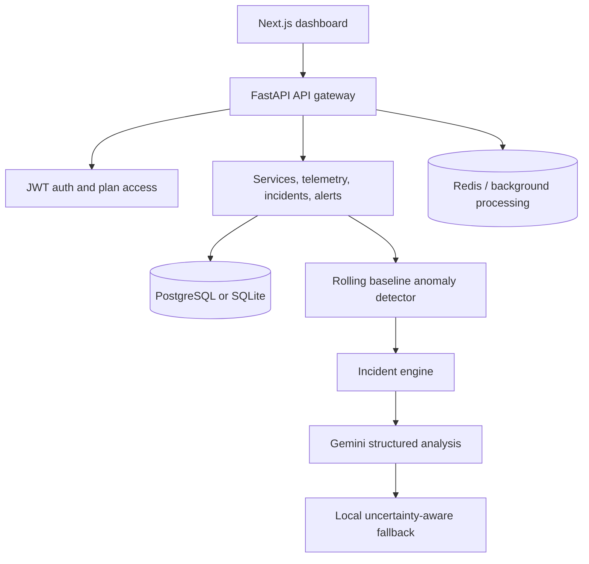

# NeuraOps AI - Intelligent AI Observability & Autonomous Incident Analysis Platform

NeuraOps AI is a full-stack observability platform for software systems and AI-powered applications. It ingests telemetry, detects explainable anomalies, correlates incidents, and uses structured LLM analysis to produce cautious, actionable investigation guidance.

## Features

- JWT authentication with protected application routes.
- FREE and PRO plan metadata, server-side feature checks, and daily quotas.
- Logs, metrics, health, errors, HTTP requests, and event ingestion.
- Rolling-baseline anomaly detection with evidence and severity.
- Incident investigation, status changes, related logs, alerts, and AI analysis.
- Gemini integration with an uncertainty-aware local fallback.
- Dashboard views for services, incidents, logs, metrics, alerts, health, settings, and pricing.

## Architecture



## AI Architecture

The AI layer receives structured incident context: incident fields, affected services, recent logs, anomalies, metrics, events, dependencies, and timestamps. It returns separate summary, suspected root cause, confidence, evidence, affected components, recommended actions, and investigation steps. Prompts require uncertain hypotheses to remain explicitly suspected until verified.

## System Flow

Telemetry -> Detection -> Incident -> Context Retrieval -> AI Analysis -> Recommendation

## Technology Stack

- Frontend: Next.js, TypeScript, Tailwind CSS, Recharts, Framer Motion, Lucide React
- Backend: FastAPI, Pydantic, SQLAlchemy, PostgreSQL, Redis
- AI: Gemini API with structured prompts and fallback behavior
- DevOps: Docker, Docker Compose, GitHub Actions
- Testing: Pytest, ESLint, TypeScript, Next.js production build

## Backend Architecture

FastAPI routes validate requests and use SQLAlchemy models for persistence. Authentication is centralized in `get_current_user`; application routers require JWTs, while health and authentication registration/login remain public. Plan and quota decisions live in `backend/app/services/access.py`, keeping authorization on the server.

## Frontend Architecture

Next.js App Router pages use a shared API wrapper that adds bearer tokens and redirects expired sessions to login. `AuthGate` protects the dashboard shell. Login, registration, pricing, and settings provide the account and subscription workflow.

## Database

PostgreSQL is the containerized deployment target and SQLite is supported for local testing. Models cover users, services, logs, metrics, incidents, anomalies, alerts, telemetry events, AI analyses, and usage records. Frequently queried timestamps, service IDs, statuses, severities, and foreign keys are indexed.

## Authentication

Registration creates a FREE user with a bcrypt password hash. Login returns a signed JWT. Protected API routers validate the bearer token, while the frontend stores and clears the token for session and logout behavior. Production deployments must provide a strong `JWT_SECRET_KEY` and explicit CORS origins.

## FREE vs PRO

FREE includes dashboard, basic telemetry, limited services, and daily AI/incident/log quotas. PRO unlocks advanced AI RCA, extended analytics, alerts, history, exports, and unlimited configured quotas. The API returns structured `403` responses for plan restrictions and quota responses when limits are exhausted.

## Anomaly Detection

`BaselineDetector` maintains a bounded per-service, per-metric window. After enough history exists, it compares new values with the rolling mean and standard deviation, emitting a severity, expected baseline, deviation, timestamp, and explanation when thresholds are crossed.

## AI Root Cause Analysis

The Gemini service normalizes provider output into a stable response model. Missing credentials, network errors, malformed responses, and unavailable provider output use a local fallback that labels uncertainty and recommends verification instead of presenting a hypothesis as fact.

## API Documentation

With the backend running, OpenAPI is available at `/docs` and `/redoc`. Route groups are Authentication, Telemetry, Services, Metrics, Logs, Incidents, Alerts, AI Analysis, Dashboard, and Health. Authenticated endpoints expect `Authorization: Bearer <token>`.

## Local Development

1. Create and activate a Python environment in `backend`.
2. Install backend dependencies with `pip install -r requirements.txt`.
3. Install frontend dependencies with `cd frontend` and `npm install`.
4. Copy `.env.example` to `.env` and set local values.
5. Start the backend with `uvicorn app.main:app --reload`.
6. Start the frontend with `npm run dev`.
7. Open `http://localhost:3000`.

## Environment Variables

`.env.example` contains placeholders for `DATABASE_URL`, `REDIS_URL`, `NEXT_PUBLIC_API_URL`, `GEMINI_API_KEY`, `JWT_SECRET_KEY`, `JWT_ALGORITHM`, and `ACCESS_TOKEN_EXPIRE_MINUTES`. No real credentials belong in the repository. Development defaults use SQLite and local origins; production should use PostgreSQL, managed Redis, secret storage, and a restricted CORS allowlist.

## Deployment

The intended deployment split is:

```text
Vercel -> Next.js Frontend -> FastAPI Backend -> PostgreSQL / Redis -> Gemini API
```

### Frontend Deployment - Vercel

Connect the repository to Vercel and set the project root to `frontend` when prompted. Configure `NEXT_PUBLIC_API_URL` to the deployed FastAPI base URL, then deploy the Next.js project using the existing `build` script. The Gemini key is never configured in Vercel.

### Backend Deployment

Deploy `backend` to a Python-compatible host. Configure `DATABASE_URL`, `REDIS_URL`, `GEMINI_API_KEY`, `JWT_SECRET_KEY`, `JWT_ALGORITHM`, `ACCESS_TOKEN_EXPIRE_MINUTES`, and `FRONTEND_URL`. `FRONTEND_URL` must be the deployed Vercel origin so CORS remains restricted. Redis is configured for the architecture but is not required for basic API startup.

### Production Checklist

- Environment variables configured without committing secrets.
- External PostgreSQL connection verified.
- Redis configured if background processing is enabled.
- `FRONTEND_URL` and CORS verified.
- `NEXT_PUBLIC_API_URL` points to FastAPI.
- Gemini key configured only on the backend.
- Backend `/health` responds successfully.
- Frontend lint and production build pass.

## Testing

Backend:

```powershell
cd backend
pytest -q
```

Frontend:

```powershell
cd frontend
npm install
npm run lint
npm run build
```

The backend suite covers authentication, protected routes, FREE/PRO authorization, usage limits, telemetry, incident retrieval and status changes, and AI fallback behavior.

## Docker

`docker-compose.yml` runs PostgreSQL, Redis, FastAPI, and Next.js. `backend/Dockerfile` and `frontend/Dockerfile` provide standalone images. The compose configuration uses the installed psycopg 3 driver and waits for database/Redis health checks.

## CI/CD

GitHub Actions installs backend dependencies and runs `pytest -q`, then installs frontend dependencies and runs both `npm run lint` and `npm run build`.

## Security

Secrets are environment-only, `.env` is ignored, passwords are bcrypt-hashed, JWTs are signed with a configured secret, Gemini credentials are read only by the backend, and plan/quota decisions are enforced in API code. Remaining production work includes persistent token revocation, billing-provider integration, rate limiting, and migration tooling.

## Future Improvements

- Add Alembic migrations and persistent background workers.
- Add billing-provider webhooks and durable subscription state transitions.
- Add RBAC, WebSocket streaming, richer correlation, and notification integrations.
